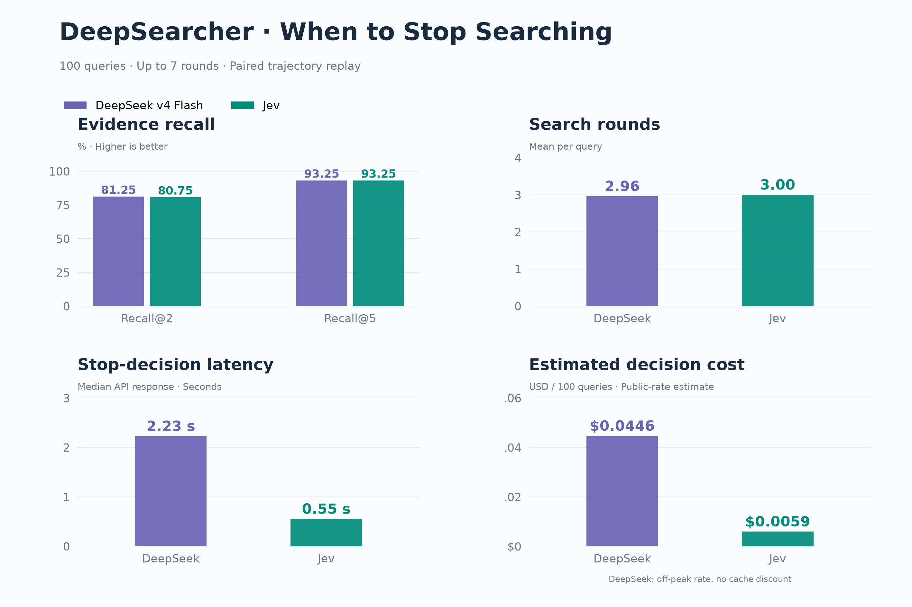

# Adaptive search stopping: DeepSeek and Jev

This experiment tests whether Jev can replace the ChainOfRAG reflection call that decides when to stop searching. On 100 sampled 2WikiMultiHopQA queries, the two policies have the same aggregate Recall@5 (93.25%) and nearly identical mean search depth (2.96 versus 3.00 rounds). Jev's measured median decision response is shorter and its estimated decision cost is lower. This is an evaluation harness, not a change to the application's default agent.



## Results

| Metric | DeepSeek stopping | Jev stopping | Always run 7 rounds |
|---|---:|---:|---:|
| Recall@2 | 81.25% | 80.75% | 83.75% |
| Recall@5 | 93.25% | 93.25% | 97.00% |
| All supporting titles retrieved | 85% | 86% | 93% |
| Mean rounds | 2.96 | 3.00 | 7.00 |
| Queries missing evidence found in later rounds | 8 | 8 | 0 |
| Median stop-decision API response | 2.23 s | 0.55 s | — |
| Estimated decision cost / 100 queries | $0.0446 | $0.0059 | — |

The policies finish at the same round on 85 queries. Jev stops earlier on 6 (2 lose evidence coverage) and later on 9 (2 gain coverage). Decisions agree on 92.57% of the 700 shared states. Aggregate equality therefore does not imply identical behavior. Jev does not reduce search depth in this sample, and neither stopping policy preserves all the evidence found by seven rounds.

## Protocol and relation to the historical evaluation

The existing 1,000-query dataset is sampled with seed `20260922`, stratified by its original types: 41 compositional, 24 comparison, 24 bridge-comparison, and 11 inference queries. IDs, indices, dataset hash, prompt-source hash, and the exact question/criteria are frozen in [the manifest](results/manifest.json).

Each query produces one complete seven-round trajectory. Both stopping models see the same main question and accumulated intermediate questions and answers at each round. Each policy is replayed to its first affirmative decision, or the seven-round cap. Seven is a **maximum** for these policies; the reference deliberately executes all seven rounds. Full trajectories allow later missed evidence to be measured. This is paired shared-trajectory replay, not independent end-to-end timing.

Query generation, intermediate answers, and the baseline stopping decisions use an OpenAI-compatible API with model identifier `deepseek-v4-flash`. This identifier records the service used in the experiment; it is not a verification of the underlying model weights. The original ChainOfRAG prompts are preserved byte-for-byte in [a source fixture](fixtures/chain_of_rag.py) and parsed without importing or executing that file. Jev uses `jev-1.13.0`, one `noul` question, explicit true/false criteria including missing multi-hop links, and a fixed threshold of 0.5. No prompt or threshold tuning was performed on this frozen sample.

Retrieval uses the historical 6,119-document corpus rebuilt with BGE-large-en-v1.5, normalized CLS embeddings, cosine similarity and top 5 retrieval. BGE tokenization truncates 90 documents to 512 tokens for embedding; the full stored document text remains available to generation. The corpus is available as a checksummed download; the exact embedding revision is recorded in this directory. Corpus metadata and order are preserved; only machine-specific file references were replaced with a relative dataset filename.

Recall is based on supporting **document titles**, with first-seen text deduplication and accumulation across rounds. It is not final-answer accuracy. The older evaluation used a different embedding setup (ada-002); its published results are left unchanged and should not be used as a controlled baseline for this experiment.

## Timing and cost

The latency panel uses 689 newly executed successful decision requests per model, across the complete trajectories; it excludes cached calls and retries. It measures API response latency under the tested service and network conditions, not total search time or intrinsic model throughput. The full experiment took approximately 100 minutes. One transport error was retried successfully; no HTTP 429 or invalid output was recorded.

Decision cost includes only the calls that each stopping policy would execute: DeepSeek 296 calls (68,313 input and 57,322 output tokens, including reported reasoning); Jev 300 calls (140,893 input tokens). It excludes query generation, intermediate answers, document selection, embeddings and database costs.

DeepSeek is estimated at the [public Flash off-peak reference rates](https://api-docs.deepseek.com/quick_start/pricing/) of $0.15/M input and $0.60/M output, without cache discounts. These rates refer to V4.1 Flash and are a pricing proxy for the recorded `deepseek-v4-flash` service, not a measured bill. The estimates exclude cache discounts and should be recalculated for the provider used in a new run. Jev uses the experiment's $0.042/M input reference. The resulting estimates are $0.04464015 and $0.005917506 per 100 queries. The price assumptions and usage totals are recorded in [decision_cost_estimate.json](results/decision_cost_estimate.json).

The actual full-trajectory experiment made 689 new Jev calls and used about $0.0149; that experiment expenditure is distinct from the $0.0059 policy deployment estimate.

## Recompute the published results without API calls

Run from this directory:

```bash
uv run python fetch_artifacts.py
uv run python replay_results.py
uv run python -m unittest test_full100 -v
uv run python plot_comparison.py
```

The replay checks all 100 queries and 700 states, recomputes evidence metrics, policy stopping positions, token/request totals and decision cost inputs against the published summaries. Per-round traces, per-query results, per-call usage and sanitized attempt timing records are downloaded into the ignored `artifacts/` directory. The original paid run additionally audited every request prompt and response against its raw cache before marking the run complete. The published artifacts are sufficient for offline metric replay. API-reported usage and latency are recorded observations; verifying them independently requires a new API run.

## Included files

| Path | Purpose |
| --- | --- |
| `results/` | Compact aggregate report, sample manifest, cost assumptions, and one PNG chart |
| `fixtures/` | Frozen ChainOfRAG prompt source and embedding revision |
| `artifact_manifest.json` / `fetch_artifacts.py` | Pinned download source and SHA-256 checks for the optional corpus and detailed records |
| `replay_results.py` | Recompute and check published aggregates without API calls |
| `run_full100.py` / `finalize_full100.py` | Resume a new experiment and audit completed results |
| `test_full100.py` | Offline checks for parsing, retries, rate limiting, and sampling |

The questions come from the repository's existing [`2wikimultihopqa.json`](../../examples/data/2wikimultihopqa.json). The downloadable corpus is the retrieval material used for that evaluation. This directory has its own uv environment and does not add dependencies to the application.

## Integration scope

Jev is called only by this evaluation runner. Installing DeepSearcher does not enable Jev or change `ChainOfRAG`. A production integration would expose a configurable stopping policy in the agent, with explicit timeout and failure behavior; it is outside this experiment's scope.

## Archive and download policy

The detailed records remain in the [original experiment archive](https://github.com/zc277584121/deep-searcher/tree/3c4021aa400b71ce48926fb0f1b11282aa7b933f/evaluation/jev_stopping). Downloads use this fixed commit, never a moving branch. `artifact_manifest.json` lists the size and SHA-256 of every downloaded file. Existing valid files are reused, so interrupted downloads can be resumed by rerunning the command. The archive is hosted on a contributor fork; if that source becomes unavailable, a mirror must serve the same verified bytes.

Offline replay needs the detailed records but no credentials or paid API calls. A fresh experiment needs only the corpus download and your own API credentials; its results may differ from the recorded run. The unit tests and chart generation use only files retained in this PR and do not need downloads.

## Run a new experiment

Use a Linux environment supported by Milvus Lite; a CUDA GPU is recommended for BGE. Dependencies for execution are optional and isolated from the main project. Set your own OpenAI-compatible service and credentials in the environment:

```bash
cd evaluation/jev_stopping
export LLM_BASE_URL="https://your-provider.example/v1"
export LLM_MODEL="your-provider-model-id"
# Set LLM_API_KEY and TYPESAFE_API_KEY securely in your shell.
export EXPERIMENT_DIR="$PWD/runs/my-experiment"
uv sync --extra run
uv run python fetch_artifacts.py --corpus-only
uv run --extra run python prepare_index.py
uv run --extra run python run_full100.py
uv run --extra run python finalize_full100.py
```

Choose a model identifier supported by your endpoint; the recorded run used `deepseek-v4-flash`. Changing the endpoint or model creates a new comparison, not an exact reproduction of the measured latency.

`prepare_index.py` downloads the pinned BGE model and reconstructs the index from the downloaded corpus; it makes no paid API calls. `BGE_MODEL_PATH` can point to an existing model snapshot and `BGE_DEVICE` can select `cpu` or `cuda`. A rerun may differ due to provider/model changes, numerical differences and generation nondeterminism.

The runner processes 8 queries concurrently but globally spaces generation requests by at least 2.3 seconds. It honors Retry-After, pauses on rate limits, retries transient failures with bounded backoff, and persists each completed round and validated response. Re-running the same command resumes the same manifest; configuration changes require a new experiment directory. Credentials are never written to call logs. `JEV_KEY_NAMES` optionally names a comma-separated list of environment variables for credential fallback.

For an SSH-independent run, use a terminal multiplexer such as `tmux` and run the same commands inside it. Inspect `status.json` and `attempts.jsonl` under `EXPERIMENT_DIR`; run `finalize_full100.py` only after the runner reports `ready_for_audit`. Fresh runs stay under the ignored `runs/` directory and do not overwrite the published `results/`.
